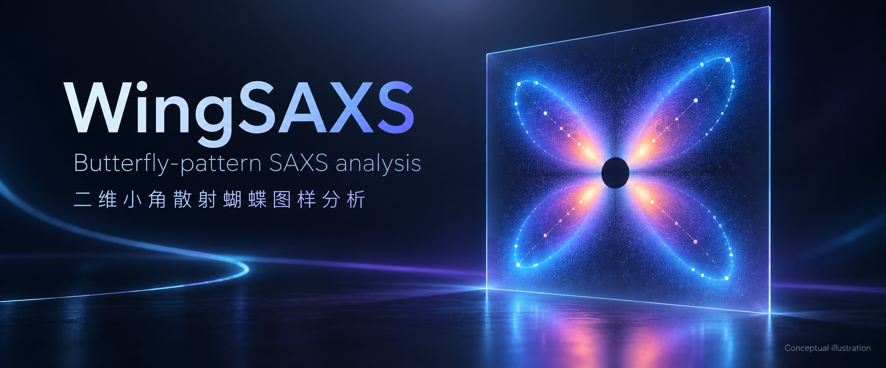

<h1 align="center">
  
</h1>

<p align="center">
  <strong>Trace observed butterfly trajectories across 2D SAXS images and follow their evolution through an in-situ series.</strong><br>
  从二维 SAXS 图像中提取可观测蝴蝶轨迹，并跟踪其在原位序列中的演化。
</p>

<p align="center">
  <a href="https://github.com/D-sudoasd/WingSAXS/actions/workflows/ci.yml"></a>
  
  
  <a href="LICENSE"></a>
</p>

<p align="center">
  <a href="#english">English</a> · <a href="#中文说明">中文说明</a> · <a href="#quick-start">Quick start</a> · <a href="#安装与启动">安装与启动</a> · <a href="#documentation">Documentation / 文档</a> · <a href="#scientific-scope">Scientific scope / 科学边界</a>
</p>

## English

WingSAXS reads calibrated detector frames (CBF, EDF, TIFF, NPY/NPZ, HDF5), derives physical `q`, `χ`, `qx`, and `qy` from PONI geometry through pyFAI, and traces the butterfly arcs supported by the measured intensity.

| Observed evidence / 观测证据 | Reported quantities / 输出量 |
| --- | --- |
| q-ring profiles and observed petal trajectories<br>q 环剖面与实测花瓣轨迹 | First-order `q*` and ring period `L = 2π/q*`<br>一阶 `q*` 与环尺度 `L = 2π/q*` |
| Occupied sides and supported branches<br>实际占据象限与有数据支持的分支 | Apparent `a`, `b/a`, and `θ`, with support and confidence<br>表观 `a`、`b/a`、`θ`，并附观测支持与可信度 |
| Missing lobes and rings remain missing<br>缺失花瓣与 q 环保持缺失 | Conditional **Ln / Lz / L major** candidates<br>附条件的 **Ln / Lz / 长轴 L** 候选 |
| Ring diagnosis and fit limitations<br>环诊断与拟合限制 | Finite boundary or extrapolated candidates remain inspectable; ring L and Ln stay distinct<br>有限边界值或外推候选仍可检查；环尺度 L 与 Ln 分列 |

A successful fit is not scientific acceptance. Pixel-q does not provide a physical period, and missing quadrants are never synthesized.<br>
拟合成功不等于科学结论已获接受；像素 q 不能给出物理周期，也不会补造缺失象限。

### Example / 示例


Synthetic demonstration (pixel-q): the empirical double ellipse is overlaid on a generated butterfly pattern. The measured trajectories and confidence information remain visible.<br>
合成示例（pixel-q）：在生成的蝴蝶图样上叠加经验双椭圆，同时保留实测轨迹与可信度信息。

## What it does

- **Independent 2D measurements**: point/line/local-region measurements and annular azimuthal peak fits use the current image, calibration and mask without requiring an ellipse fit. No standalone 1D spectrum workflow is added. See the [2D measurement guide](docs/image_measurements_zh.md).
- **SAXSAnalyzer migration**: reopen 2D images, inspect historical evidence, and use sector-based low-q diagnostics within the image workbench. See the [migration guide](docs/saxsanalyzer_migration_zh.md).
- **Butterfly arcs** (`ridge_method=butterfly_curvature`): curvature ridges, branch/side labels (QI+QIII vs QII+QIV), first-order family vs harmonics, sparse-ring fill. See the [butterfly arc guide](docs/butterfly_arcs_zh.md).
- **Annular butterfly trajectories**: the new workbench session defaults to fixed-q annuli and angular profiles `I(χ)`, connecting up to four observed lobe maxima into long butterfly petals. Each ring retains its raw profile, counts, and coverage; missing lobes/rings remain missing. See the [annular trajectory guide](docs/annular_trajectories_zh.md).
- **Independent radial diagnostics**: `radial_sector` measures fixed-χ `I(q)` profiles for a separate check. Its `q*` values are not the default butterfly trajectory or the primary ellipse input. See the [radial-sector guide](docs/sector_peaks_zh.md).
- **Estimates with confidence**: the default `standard` fit follows the measured trajectories. Optional `flat_ellipse` / `very_flat_ellipse` presets supply explicit bounds. Finite boundary or extrapolated solutions remain inspectable candidates, with their support and limitations alongside the values.
- **Batch review**: independent or warm-start fitting, cancel/progress, checkpoints, streaming CSV/JSON/NPZ. Limited results remain warning frames in the sequence; missing measurements remain gaps. Resolved geometry can initialize the next frame, which is refitted to its own data.
- **Reusable analysis reports**: `bsaxs report results/batch` derives per-frame and sequence figures plus long measurement tables from existing native batch exports without refitting, including stored normal profiles and fit-support figures when those records exist. Add `--report --package` to a batch run to generate the report and browsable ZIP in the same run; multiple samples can be reported from one parent directory. See the [analysis report guide](docs/analysis_report_zh.md).
- **Workbench**: Identify trajectories → Evaluate; bilingual UI; first-order ring overlay instead of a capped tilted ellipse; lamellar studio and 0.4 publication artboards are schematics, not a unique inversion ([studio](docs/lamellar_workbench_zh.md), [figures](docs/publication_figures_zh.md)).
- **Optional `full2d`**: empirical whole-pixel intensity refinement. It is a different model from the butterfly geometry measurement.
- **Measurement and fit figures**: export fixed-size SVG/PDF and high-resolution TIFF/PNG with source arrays, curve/profile CSVs, and checksums. Inspect measured data, candidate ellipses, overlays, and actual `full2d` predictions without promoting a candidate to a scientifically accepted result. See the [figure export guide](docs/butterfly_figures_zh.md).
- **Figure delivery**: choose column width and resolution in one export window, then browse the complete figure bundle offline through `index.html`. Annular/radial source CSV and technical figure checks accompany the images; formatting checks do not imply scientific acceptance.
- **Peak diagnostics**: locate the raw brightest pixel separately from supported lobe peaks; inspect measured/model peak positions, local zooms, angular/radial profiles, and clean overlays from each fit source. Peak coordinates and support flags also travel through batch exports.
- **Preflight and P3/P4 gates**: read-only package checks and evidence reports. They do not freeze science or replace named human review.

## Install

Python **3.11–3.13** (3.14+ is outside the support contract). Core analysis does not need Qt; the workbench does.

```powershell
git clone https://github.com/D-sudoasd/WingSAXS.git
cd WingSAXS
py -3.13 -m venv .venv-project
.\.venv-project\Scripts\python.exe -m pip install --upgrade pip
.\.venv-project\Scripts\python.exe -m pip install `
  -c constraints\validation-py311-313.txt -e ".[all]"
.\.venv-project\Scripts\bsaxs-doctor.exe --require-ui
```

Linux / macOS:

```bash
python -m venv .venv-project
.venv-project/bin/python -m pip install --upgrade pip
.venv-project/bin/python -m pip install \
  -c constraints/validation-py311-313.txt -e ".[all]"
.venv-project/bin/bsaxs-doctor --require-ui
```

Core-only: `python -m pip install -e .` then `bsaxs-doctor` without `--require-ui`.

For Chinese figure text on Debian/Ubuntu, install a CJK font: `sudo apt-get install fonts-noto-cjk`. The renderer selects an installed CJK font; CI installs Noto CJK so missing-glyph checks run on Linux as well as Windows.

On Windows, the supported project-local environment is `.venv-project`; the launcher checks it first, matching the environment used by the documented CLI commands. After the doctor is green, double-click `启动_WingSAXS.cmd` or run `.\启动_WingSAXS.cmd --check`. Details: [first-run guide](docs/first_run_zh.md).

## Quick start

```bash
bsaxs-doctor --require-ui
bsaxs synthetic --shape 128x128 -o synthetic.npz
bsaxs inspect synthetic.npz
bsaxs-gui synthetic.npz
```

Calibrated detector frame — geometry / butterfly measurement (not `--full2d`):

```bash
bsaxs inspect data/frame_0001.edf --poni geometry/detector.poni --mask masks/detector.npy
bsaxs analyze data/frame_0001.edf --poni geometry/detector.poni --mask masks/detector.npy \
  --ridge-method butterfly_curvature --ellipse-preset standard \
  --butterfly-stage evaluate --butterfly-resamples 0 \
  -o results/frame_0001
```

Folder of frames:

```bash
bsaxs batch "data/frame_*.edf" --poni geometry/detector.poni --mask masks/detector.npy \
  --ridge-method butterfly_curvature --ellipse-preset standard \
  --butterfly-stage evaluate --mode independent \
  -o results/batch --checkpoint results/checkpoint.json
```

For a reusable data and figure package, add `--stream --report --package` to the batch command. The report is derived from the saved native arrays and fit records; an existing batch can also be reported with `bsaxs report results/batch` without repeating the fit. See the [analysis report guide](docs/analysis_report_zh.md).

Read-only package check before fitting real data:

```bash
bsaxs preflight data/package --manifest manifest.csv \
  --poni geometry.poni --mask mask.npy -o results/preflight
```

For an unattended package run, use `bsaxs batch "data/package/images/*.edf" --unattended data/package --manifest data/package/manifest.csv --poni data/package/geometry.poni --mask data/package/mask.npy -o results/unattended_001`. This performs preflight before fitting, writes a checkpoint and streams batch evidence. A red preflight blocks fitting; warnings or failed frames return a nonzero exit status. Keep the output outside the raw package and use `--resume` with the same inputs and settings after interruption.

Finish existing batch exports without fitting or drawing again: `bsaxs package results/all_samples` creates a browsable sample/data/figure index and ZIP. Use `--resume` to finish an interrupted delivery or reuse an unchanged archive, `--no-archive` for navigation only, or add `--package` to a new `bsaxs batch` run to continue through delivery automatically. Original warnings and missing outputs stay visible. [Batch delivery guide](docs/batch_delivery_zh.md)


`bsaxs analyze ... --full2d` is the optional empirical intensity fit. `bsaxs-gui` is the crash-visible desktop entry (same as `启动_WingSAXS.cmd`); `bsaxs gui` remains a supported CLI alias that opens the workbench.

Agents (and any non-interactive operator) should start with `bsaxs describe` or a bare `bsaxs`. That prints a JSON catalog of commands, exit codes, and scientific invariants. Environment checks: `bsaxs doctor --json` (same as `bsaxs-doctor`). Failed commands emit a JSON error envelope on stdout and a human `错误：` line on stderr. See [AGENTS.md](AGENTS.md).

## Names

| Shown to people | Stable machine name |
| --- | --- |
| WingSAXS | PyPI / wheel: `butterfly-saxs` |
| | Import: `butterfly_saxs` |
| | CLI: `bsaxs`, `bsaxs-doctor`, `bsaxs-gui` |

## Documentation

| Topic | Page |
| --- | --- |
| First launch and recommended UI order | [docs/first_run_zh.md](docs/first_run_zh.md) |
| Agent / automation CLI contract | [AGENTS.md](AGENTS.md) |
| CLI, TOML, batch, masks, exports | [docs/user_guide_zh.md](docs/user_guide_zh.md) |
| Batch statistics, sequence figures, and reusable data/figure package | [docs/analysis_report_zh.md](docs/analysis_report_zh.md) |
| Butterfly arcs and publication rules | [docs/butterfly_arcs_zh.md](docs/butterfly_arcs_zh.md) |
| Fixed-q annular butterfly trajectories | [docs/annular_trajectories_zh.md](docs/annular_trajectories_zh.md) |
| Fixed-χ radial sector peaks | [docs/sector_peaks_zh.md](docs/sector_peaks_zh.md) |
| Measurement / peak figures | [docs/butterfly_figures_zh.md](docs/butterfly_figures_zh.md) |
| Symbols, units, and interpretation limits | [docs/scientific_basis_zh.md](docs/scientific_basis_zh.md) |
| Architecture | [docs/architecture_zh.md](docs/architecture_zh.md) |
| Lamellar studio / publication artboards | [docs/lamellar_workbench_zh.md](docs/lamellar_workbench_zh.md), [docs/publication_figures_zh.md](docs/publication_figures_zh.md) |
| P3 / P4 evidence | [docs/validation/benchmark_protocol.md](docs/validation/benchmark_protocol.md) |
| JAC manuscript and quantitative validation | [docs/jac/README.md](docs/jac/README.md) |
| 2D capability acceptance and remaining work | [docs/validation/2d_capability_acceptance_zh.md](docs/validation/2d_capability_acceptance_zh.md) |
| Independent lamellar sequence and noise controls | [docs/validation/lamellar_sequence_zh.md](docs/validation/lamellar_sequence_zh.md) |

## Scientific scope

The double ellipse is an **empirical reciprocal-space measurement**. The current annular engineering route is documented against Murthy & Grubb (2024), especially §4.1 on z-slices, minimum-curvature peak trajectories, and the two-ellipse butterfly description: [IUCr article](https://journals.iucr.org/j/issues/2024/04/00/tu5052/). It is not claimed as a reproduction of the 2021 algorithm; the 2007 and 2021 full texts were not obtained and read for this tuning. One 2D pattern does not uniquely recover a 3D lamellar stack or a deformation mechanism.

---

## 中文说明

WingSAXS 面向取向层片的各向异性二维 SAXS 蝴蝶纹：用 PONI（pyFAI）得到物理 `q/chi/qx/qy`，提取固定 q 环的 `I(χ)` 花瓣轨迹，并只发表图像真正支持的量。

有径向反射峰和物理 q 单位时，可报告 **L = 2π/q***，其级次与结构解释同时保留说明。annular 的 `q_annulus` 是固定 q 环采样坐标。表观 `a`、`b/a`、`θ` 和条件性的 **Ln / Lz / 长轴 L** 候选随拟合结果保留，并标明观测支持、可信度和限制；碰到边界或长轴超出观测范围时，数值仍可检查和导出。默认使用 `standard`，扁椭圆边界由用户明确选择。环 L 与 Ln 分列，缺失象限不镜像补齐，未标定的像素 q 不换算为 nm。

### 安装与启动

支持 Python 3.11–3.13。Windows：

```powershell
git clone https://github.com/D-sudoasd/WingSAXS.git
cd WingSAXS
py -3.13 -m venv .venv-project
.\.venv-project\Scripts\python.exe -m pip install --upgrade pip
.\.venv-project\Scripts\python.exe -m pip install `
  -c constraints\validation-py311-313.txt -e ".[all]"
.\.venv-project\Scripts\bsaxs-doctor.exe --require-ui
.\启动_WingSAXS.cmd --check
.\启动_WingSAXS.cmd
```

蝴蝶页建议顺序：**识别 → 评估**（曲率模式下识别步骤显示为“识别弧”）。详见[首次启动](docs/first_run_zh.md)。

新建 GUI 会话默认按固定 q 环计算角向 `I(χ)`，用 q 环上的角向峰连接四条花瓣轨迹；默认 q 环数 40、方位角分箱 72。每个 q 环最多保留四个实际支持峰，少于四个就保留少数峰，不镜像补象限；缺环造成的轨迹断点也不桥接。历史项目缺少 `trace_method` 时保持曲率路径兼容，历史 `ridge_method=butterfly_curvature` 的分支/象限 family 仍可复现。固定 χ 的 `radial_sector` 只作为独立径向诊断，不是默认主椭圆输入。详见[固定 q 环花瓣轨迹](docs/annular_trajectories_zh.md)与[径向扇区诊断](docs/sector_peaks_zh.md)。

annular 点的 `q_annulus` 是预设 q 环的采样坐标，不是径向反射峰 `q*`，不能换算成 `2π/q`。椭圆拟合使用固定参考轴的对角配对，不能逐个花瓣重新指派；外层 q 窗口边界也不能冒充真实长轴尖端。

评估后可在「叠加图层」分别检查实测谱、观测轨迹、几何候选和全像素模型椭圆；峰位表区分原始最亮点 G 与受支持峰 P，选中行即可定位。导出同时包含干净叠加图、峰位图、局部放大、剖面及 CSV/NPZ 源数据。匹配差或参数不稳定时会保留明确提示，不能仅凭曲线看起来像蝴蝶判定拟合正确。详见[测量图与峰位导出](docs/butterfly_figures_zh.md)。

### 常用命令

```bash
bsaxs describe
bsaxs doctor --json
bsaxs inspect data/frame_0001.edf --poni geometry/detector.poni --mask masks/detector.npy
bsaxs analyze data/frame_0001.edf --poni geometry/detector.poni --mask masks/detector.npy \
  --ridge-method butterfly_curvature --ellipse-preset standard \
  --butterfly-stage evaluate --butterfly-resamples 0 -o results/frame_0001
bsaxs analyze data/frame_0001.edf --poni geometry/detector.poni --mask masks/detector.npy \
  --butterfly-stage evaluate --butterfly-trace-method annular_peak \
  --annular-rings 40 --annular-angles 72 --butterfly-resamples 0 \
  -o results/frame_0001_annular
bsaxs batch "data/frame_*.edf" --poni geometry/detector.poni --mask masks/detector.npy \
  --ridge-method butterfly_curvature --ellipse-preset standard \
  --butterfly-stage evaluate --mode independent -o results/batch
bsaxs report results/batch
bsaxs-gui data/frame_0001.edf --poni geometry/detector.poni
```

`bsaxs report` 从已有批次数组与拟合记录生成逐帧/序列统计、CSV 长表和图表，不重跑拟合；已保存法向 profile 和拟合支持诊断时，也会生成相应逐帧图。批处理可添加 `--stream --report --package` 一次完成分析、图表和 ZIP 交付。详见[批次分析报告与数据、图表包](docs/analysis_report_zh.md)。`--full2d` 才是可选的整幅经验强度精修，与蝴蝶几何测量不是同一条路径。批处理表用「警告 · 仅环 / 椭圆」区分发表状态；环 L 与 Ln 候选分列。

公开展示名是 `WingSAXS`；安装包仍为 `butterfly-saxs`，导入仍为 `butterfly_saxs`，主命令仍为 `bsaxs`。

科学量、单位与不可扩大解释的边界见[科学量与解释边界](docs/scientific_basis_zh.md)；操作与导出见[用户指南](docs/user_guide_zh.md)。

## License

[MIT](LICENSE)
